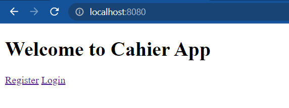
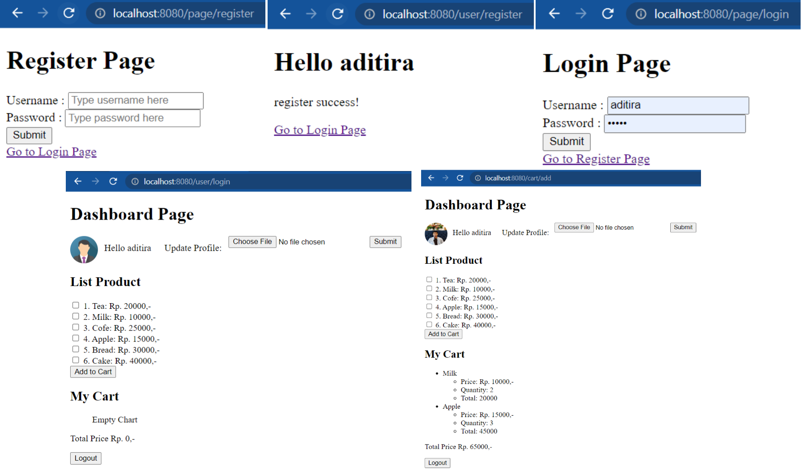

# Final Project - Basic Golang

## Cashier App



### Description

Disini kamu diminta untuk membuat aplikasi bernama **Cashier App** yang berfungsi untuk melihat list product yang bisa di beli dan dapat memasukannya ke keranjang  berapapun jumlahnya sekaligus menghitung berapa total harga per-barang yang harus di bayar dan berapa total belanjaan yang harus di bayar. Oleh karena itu, fitur yang yang harus dibuat dari aplikasi ini adalah:

- Register
- Login
- Add Product to Cart
- View Image Profile
- Update Image Profile
- Logout

Buatlah chain middleware untuk menghandle Method dan Authentication dengan menggunakan metode session based token lalu simpan semua data user dan cart di file JSON.

### Constraints

Berikut adalah tampilan dari aplikasi cashier app:



Berikut adalah hal-hal yang harus diperhatikan dalam mengerjakan aplikasi cashier app ini:

📁 **repository**

- repository/users.go
  - `AddUser()` function
    - input username and password, simpan dengan format:

      ```go
      type Credentials struct {
          Password string `json:"password"`
          Username string `json:"username"`
      }
      ```

      Jadikan sebuah _list of struct_, _encode_ menjadi **json** dan simpan pada file `/data/users.json`

      ```json
      [{"password":"<password>", "username":"<username>"}]
      ```

- repository/sessions.go
  - `AddSessions()` function
    - input token uuid, username dan expired time, simpan dengan format:

      ```go
      type Session struct {
          Token    string    `json:"token"`
          Username string    `json:"username"`
          Expiry   time.Time `json:"expiry"`
      }
      ```

      Jadikan sebuah _list of struct_, _encode_ menjadi **json** dan simpan pada file `/data/sessions.json`

      ```json
      [{"token":"<token>", "username":"<username>", "expiry": "<expiry>"}]
      ```

  - `DeleteSessions()` function

    - input token target, maka akan menghapus data token tersebut dari list pada file `/data/sessions.json`

      ```json
      []
      ```

  - `CheckExpireToken()` function

    - input token target, maka akan check apakah token tersebut tersedia di file `/data/sessions.json` lalu check expired time nya.
      - Jika expired time **lebih** dari waktu sekarang, maka success `return token`
      - Jika expired time **Kurang** dari waktu sekarang, maka error `return message "Token is Expired!"`
        - Hapus token tersebut dari file `/data/sessions.json`

- repository/product.go
  - `ReadProducts()` function
    - baca data dari file `data/products.json` lalu _decode_ menjadi list dari format struct berikut:

      ```go
      type Product struct {
          Id       string `json:"id"`
          Name     string `json:"name"`
          Price    string `json:"price"`
          Quantity string
          Total    float64
      }
      ```

- repository/cart.go
  - `AddCart()` function
    - input name, list of product dan total price dengan format:

      ```go
      type Cart struct {
        Name       string `json:"name"`
        Cart       []Product
        TotalPrice float64 `json:"total_price"`
      }
      ```

      Buat data diatas menjadi slice of struct dan lakukan _encode_ menjadi **json** dan simpan pada file `/data/carts.json`

      ```json
      [{"name": "<username>", "cart": [{"id": "<id>", "name": "<name product>", "price": "<price>", "quantity": "<number>", "total": <number>},...]}, "total_price": "<number>"}]
      ```

  - `UpdateCart()` function
    - input name, list of product dan total price dengan format:

      ```go
      type Cart struct {
        Name       string `json:"name"`
        Cart       []Product
        TotalPrice float64 `json:"total_price"`
      }
      ```

      Baca data existing dan compare data input berdasarkan field Name dan update data existing menjadi data input, lakukan _encode_ menjadi **json** dan simpan pada file `/data/carts.json`

      ```json
      [{"name": "<username>", "cart": [{"id": "<id>", "name": "<name product>", "price": "<price>", "quantity": "<number>", "total": <number>},...]}, "total_price": "<number>"}]
      ```

📁 **api**

- **Register** dengan method **POST** dan end point `/user/register`
  - Hanya boleh menggunakan method **POST** jika tidak, maka:
    - Berikan response code **405**
    - Berikan responnse message `{"error":"Method is not allowed!"}`
  - Harus memberikan request body dengan format JSON `{"username": "<username>", "password": <password>}`
    - Jika **tidak** memberikan request body, maka:
      - Berikan response code **400**
      - Berikan responnse message `{"error":"Username or Password empty"}`
    - Jika request body username dan password kosong(`""`), maka:
      - Berikan response code **400**
      - Berikan responnse message `{"error":"Username or Password empty"}`
    - Jika Ok maka:
      - Berikan response code **200**
      - Berikan response body dengan merender template `./views/status.html`

- **Login** dengan method **POST** end point `/user/login`
  - Hanya boleh menggunakan method **POST** jika tidak, maka:
    - Berikan response code **405**
    - Berikan response message `{"error":"Method is not allowed!"}`
  - Harus memberikan request body dengan format JSON `{"username": "<username>", "password": <password>}`
    - Jika **tidak** memberikan request body, maka:
      - Berikan response code **400**
      - Berikan responnse message `{"error":"Username or Password empty"}`
    - Jika request body username dan password kosong(`""`), maka:
      - Berikan response code **400**
      - Berikan responnse message `{"error":"Username or Password empty"}`
  - Jika semua Oke, maka check keberadaan username dan password pada request di file `./data/users.json` menggunakan fungsi repo `LoginValid()`.
    - Jika _username_ dan _password_ **tidak** ada, maka:
      - Berikan response code **401**
      - Berikan response message `"Wrong User or Password!"`
    - Jika _username_ dan _password_ **ditemukan**, maka:
      - Berikan response code **200**
      - Berikan response body dengan merender template `./views/dashboard.html`
      - Buatlah cookie dengan ketentuan:
        - Name:    `"session_token"`
        - Value:   `<nilai _random session token_ menggunakan github.com/google/uuid>`
        - Expires: `<expired time dengan durasi 5 jam>`
      - Lakukan penyimpanan Cookie pada file json `./data/sessions.json` dengan fungsi repo `AddSessions`

- **Logout** dengan method **GET**, **Authentication** dan end point `/user/logout`
  - Hanya boleh menggunakan method **GET** jika tidak, maka:
    - Berikan response code **405**
    - Berikan response message `{"error":"Method is not allowed!"}`
  - Harus menggunakan cookie yang bernama `"session_token"` jika tidak, maka:
    - Berikan response code **401**
    - Berikan response message `{"error":"http: named cookie not present"}`
  - Jika menggunakan cookie maka:
    - Berikan response code **200**
    - Berikan response body dengan merender template `./views/login.html`
    - Hapus data sessions user yang melakukan logout pada file json `./data/sessions.json` dengan fungsi repo `DeleteSessions()`

- **Add Product to Cart** dengan method **POST**, **Authentication** dan end point `/cart/add`
  - Hanya boleh menggunakan method **POST** jika tidak, maka:
    - Berikan response code **405**
    - Berikan response message `{"error":"Method is not allowed!"}`
  - Harus menggunakan cookie yang bernama `"session_token"` jika tidak, maka:
    - Berikan response code **401**
    - Berikan response message `{"error":"http: named cookie not present"}`
  - Jika menggunakan cookie namun tidak mengirimkan product, maka:
    - Berikan response code **400**
    - Berikan response message `{"error":"Request Product Not Found"}`html`
  - Jika menggunakan cookie dan mengirimkan product untuk dimasukan ke cart, maka:
    - Berikan response code **200**
    - Berikan response body dengan merender template `./views/dashboard.html`

- **View Image Profile** dengan method **GET**, **Authentication** dan end point `/user/img/profile`
  - Hanya boleh menggunakan method **GET** jika tidak, maka:
    - Berikan response code **405**
    - Berikan response message `{"error":"Method is not allowed!"}`
  - Harus menggunakan cookie yang bernama `"session_token"` jika tidak, maka:
    - Berikan response code **401**
    - Berikan response message `{"error":"http: named cookie not present"}`
  - Jika menggunakan cookie maka:
    - Berikan response code **200**
    - Berikan response body dengan merender gambar pada folder yang bernama `./assets/images/img-avatar.png`

- **Update Image Profile** dengan method **POST**, **Authentication** dan end point `/user/img/update-profile`
  - Hanya boleh menggunakan method **POST** jika tidak, maka:
    - Berikan response code **405**
    - Berikan response message `{"error":"Method is not allowed!"}`
  - Harus menggunakan cookie yang bernama `"session_token"` jika tidak, maka:
    - Berikan response code **401**
    - Berikan response message `{"error":"http: named cookie not present"}`
  - Jika menggunakan cookie maka:
    - Berikan response code **200**
    - Lakukan perubahan file pada folder yang bernama `./assets/images/img-avatar.png`

- ✍️ **Detail Penting untuk API!**
  - Jika terdapat error, berikan response dengan format JSON yang di encode dari struct:

    ```go
    type ErrorResponse struct {
      Error string `json:"error"`
    }
    ```

  - Untuk error lainnya, selain yang disebutkan di atas. Berikan response code **500** dan response message `"Server Internal Error"`

  - Gunakan contex untuk mendefinisikan state yang menunjukkan user sedang login dengan mengirimkan `username` sebagai success response.
  - Sessions token dikirim dari user setiap kali request ke endpoint:
    - `/cart/add`
    - `/user/img/profile`
    - `/user/img/update-profile`

⭐ **Page styling**

- Lakukan styling menggunakan css atau sejenis pada tampilan dari setiap halaman di aplikasi cashier app ini.
- Buatlah sebagus mungkin dan sekreatif mungkin dengan bebas (tidak dibatasi).
- Bagian ini akan diperiksa manual dan memiliki bobot penilaian **10%** dari total keseluruhan nilai.
- Lampirkan screenshoot pada setiap halaman yang kalian styling dan simpan pada folder berikut dengan nama file image yang sama:

  - Main page (`./views/index.html`):

    

  - Register page (`./views/register.html`):

    

  - Status page (`./views/status.html`):

    

  - Login page (`./views/login.html`):

    

  - Dashboard page (`./views/dashboard.html`):

    

    **Note:** Pastikan foto profil berubah dengan foto masing-masing.

### Test Case Example

#### Register Page

**Input**:

```bash
http://localhost:8080/page/register
```

**Expected Output / Behavior**:


#### Login Page

**Input**:

```bash
http://localhost:8080/page/login
```

**Expected Output / Behavior**:


#### Test Case 3

**Input**:

```bash
http://localhost:8080/user/login
```

**Expected Output / Behavior**:


#### Test Case 4

**Input**:

```bash
> http://localhost:8080/cart/add
```

**Expected Output / Behavior**:


### Template

Lengkapi semua todo pada cashier app di folder **api** dan **repository** untuk melewati semua logic dari test case.

📁 **repository**

- repository/carts.go
  
  ```go
  func (u *CartRepository) AddCart(cart model.Cart) error {
        // kerjakan di sini
  }
  ```

- repository/products.go
  
  ```go
  func (u *ProductRepository) ReadProducts() ([]model.Product, error) {
        // kerjakan di sini
  }
  ```

- repository/sessions.go
  
  ```go
  func (u *SessionsRepository) DeleteSessions(tokenTarget string) error {
        // kerjakan di sini
  }

  func (u *SessionsRepository) AddSessions(session model.Session) error {
        // kerjakan di sini
  }
  ```

- repository/users.go
  
  ```go
  func (u *UserRepository) AddUser(creds model.Credentials) error {
        // kerjakan di sini
  }
  ```

📁 **api**

- api/api.go

  ```go
  func (p Page) ServeHTTP(w http.ResponseWriter, r *http.Request) {
        filepath := path.Join("views", p.File)
        fmt.Println("template: ", filepath)
        // kerjakan di sini untuk handle render template
  }

  func NewAPI(...) API {
        ...
        // kerjakan di sini untuk routing api
        return api
  }
  ```

- api/carts.go

  ```go
  func (api *API) AddCart(w http.ResponseWriter, r *http.Request) {
    ...
    // kerjakan di sini untuk add product to cart repository
  }
  ```

- api/middleware.go

  ```go
  func Auth(next http.Handler) http.Handler {
        return http.HandlerFunc(func(w http.ResponseWriter, r *http.Request) {
            // kerjakan di sini untuk middleware auth
        })
  }

  func (api *API) Get(next http.Handler) http.Handler {
        return http.HandlerFunc(func(w http.ResponseWriter, r *http.Request) {
            // kerjakan di sini untuk middleware Get
        }
  }

  func (api *API) Post(next http.Handler) http.Handler {
        return http.HandlerFunc(func(w http.ResponseWriter, r *http.Request) {
            // kerjakan di sini untuk middleware Post
        }
  }
  ```

- api/profile.go

  ```go
  func (api *API) ImgProfileView(w http.ResponseWriter, r *http.Request) {
        // kerjakan di sini untuk view image profile
  }

  func (api *API) ImgProfileUpdate(w http.ResponseWriter, r *http.Request) {
        // kerjakan di sini untuk update image profile
        ...
  }
  ```

- api/users.go

  ```go
  func (api *API) Register(w http.ResponseWriter, r *http.Request) {
        // kerjakan di sini untuk register
        ...
  }

  func (api *API) Login(w http.ResponseWriter, r *http.Request) {
        // kerjakan di sini
  }

  func (api *API) Logout(w http.ResponseWriter, r *http.Request) {
        // kerjakan di sini
  }
  ```
# cashier-app-with-go
